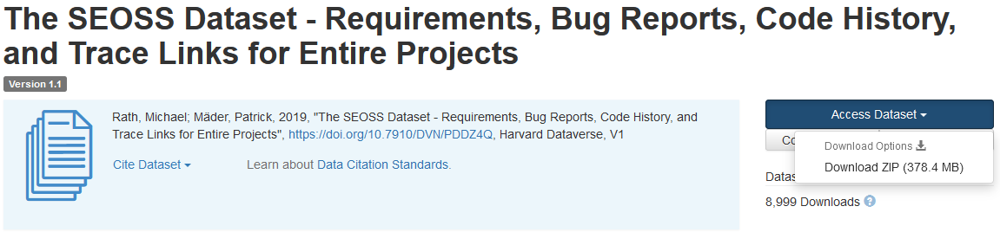

# Using Amazon Comprehend custom classifier to automate classification of IT service requests

In this post, we show you how your enterprise can implement a supervised machine learning model using custom classification with Amazon Comprehend . This post demonstrates how to implement and deploy the solution using the AWS Cloud Development Kit (AWS CDK) v2 in an isolated VPC environment consisting of only private subnets. This post will also use the code to demonstrate how you can use the [AWS CDK provider framework](https://docs.aws.amazon.com/cdk/api/v1/python/aws_cdk.custom_resources/README.html#provider-framework), a “mini-framework” for implementing provider for AWS CloudFormation custom resources to create, update, or delete a custom resource – such as an Amazon Comprehend endpoint as part of your stack lifecycle events.

## Solution Overview

Here are the high-level steps of the solution and an overview of it:
1.	Upload the [SEOSS dataset](https://dataverse.harvard.edu/dataset.xhtml?persistentId=doi:10.7910/DVN/PDDZ4Q) to the S3 bucket created as part of the training stack deployment process. The training stack deployment process creates the training stack as shown below:

    
           
     
2.	S3 multi-part upload trigger invokes the `etl_lambda` function that downloads the raw data set from S3 to EFS.
3.	`etl_lambda` function performs data preprocessing task of the SEOSS dataset.
4.	Post completion of the data preprocessing tasks by `etl_lambda`, it uploads the transformed data with prepped_data prefix to the S3 bucket.
5.	After the upload of transformed data to prepped_data prefix is complete, a successful ETL completion message is send to Amazon SNS.
6.	SNS triggers the `train_classifier_lambda` function which initiates the Amazon Comprehend classifier training in a multi-class mode. 
7.	The `train_classifier_lambda` function initiates the Amazon Comprehend custom classifier training. 
8.	Amazon Comprehend downloads the transformed data from the prepped_data prefix in S3 to train the custom classifier model.
9.	After completion of the custom classifier model training, Amazon Comprehend uploads the `model.tar.gz` file to output_data prefix of the S3 bucket. The average completion time for training the custom classifier model is approximately 10 hrs.
10.	S3 upload trigger invokes the `extract_comprehend_model_name_lambda` function which is used to retrieve the custom classifier model ARN.
11.	`extract_comprehend_model_name_lambda` function extracts the custom classifier model ARN from the S3 event payload and list document classifier call.
12.	`extract_comprehend_model_name_lambda` function sends the custom classifier model ARN to the email address that you had subscribed earlier as part of the training stack creation process. You then use this ARN to deploy the inference stack. 

This deployment then creates the inference stack as shown below. The inference stack provides you with a REST API secured by an IAM authorizer that can then be used to generate confidence scores of the labels based on the input text supplied from a third-party application or a client machine.

   

## Prerequisites
1. An AWS account
2. Python 3.7 or later, Node.js, AWS CDK v2 and Git in the development machine
3. Configure your AWS credentials to access and create AWS resources using AWS CDK
4. Download the [SEOSS dataset](https://dataverse.harvard.edu/dataset.xhtml?persistentId=doi:10.7910/DVN/PDDZ4Q)  consisting of Requirements, Bug Reports, Code History, and Trace Links of 33 open-source software projects. Save the file `dataverse_file.zip` on your local machine. Please see the below figure:

   


## AWS CDK deployment steps 
### Deploy Training Stack:
**Step 1**: Clone the GitHub repository:
`$  git clone https://github.com/aws-samples/amazon-comprehend-custom-automate-classification-it-service-request.git`

**Step 2**: Navigate to the amazon-comprehend-custom-automate-classification-it-service-request folder:
`$ cd amazon-comprehend-custom-automate-classification-it-service-request/`

**Step 3**: In the `amazon-comprehend-custom-automate-classification-it-service-request` directory, initialize the Python virtual environment and install requirements.txt with pip:
```
$ python3 -m venv .venv
$ source .venv/bin/activate
$ pip install -r requirements.txt
```

**Step 4**: If you are using AWS CDK in a specific AWS account and Region for the first time, bootstrapp your AWS CDK environment:
`$ cdk bootstrap aws://<AWS-ACCOUNT-NUMBER>/<AWS-REGION>`

**Step 5**: Synthesize AWS CloudFormation templates for this solution using cdk synth and use cdk deploy to create AWS resources 
```
$ cdk synth
$ cdk deploy VPCStack EFSStack S3Stack SNSStack ExtractLoadTransformEndPointCreateStack --parameters SNSStack:emailaddressarnnotification=<emailaddress@example.com>
```
After you enter `cdk deploy`, AWS CDK prompts whether you want to deploy changes for each of the stacks called out in the `cdk deploy` command. Enter ‘y’, for each of the stack creation prompts, then the `cdk deploy` step will progress and create these stacks .
After cdk deploy completes successfully, you create a folder with name raw_data in the S3 bucket `comprehendcustom-<AWS-ACCOUNT-NUMBER>-<AWS-REGION>-s3stack`, and in this folder upload the SEOSS dataset - `dataverse_file.zip` that was downloaded earlier.

### Deploy Inference Stack:
**Step 6**: You copy the custom classifier model ARN from the received email and use the below `cdk deploy` command to create the inference stack. This command deploys an API Gateway REST API secured by IAM authorizer, which you use for inference with an AWS user ID or IAM role that just has the `execute-api:Invoke` AWS Identity and Access Management (IAM) privilege . Since the below `cdk deploy` command needs to be run, after model training is completed which could take upto 10 hrs, ensure that you are in the Python virtual environment that you had initialized in Step 3 of the deployment steps and in the `amazon-comprehend-custom-automate-classification-it-service-request` directory:

`$ cdk deploy APIGWInferenceStack --parameters APIGWInferenceStack:documentclassifierarn=<custom classifier model ARN retrieved from email>`

**Step 7**: After the above cdk deploy completes successfully, copy the `APIGWInferenceStack.ComprehendCustomClassfierInvokeAPI` value from the console output, and use this REST API to generate inferences from a client machine or a third-party application that has `execute-api:Invoke`  AWS IAM privilege . If you are running this solution in `us-east-2`, the format of this REST API will be `https://<restapi-id>.execute-api.us-east-2.amazonaws.com/prod/invokecomprehendV1`.

Alternatively, you can use the test client `apiclientinvoke.py` from the  repository to send in a request to the custom classfier model. Before using the `apiclientinvoke.py`, ensure that:
- You have `boto3` and `requests` Python package installed using pip on the client machine.
- You have configured Boto3 credentials. By default, the test client assumes that a profile named default is present and it has `execute-api:Invoke` AWS IAM privilege on the REST API.
- `SigV4Auth` points to the AWS Region where the REST API is deployed. Update the `<AWS-REGION>` value to `us-east-2` in the `apiclientinvoke.py` , if your REST API is deployed in us-east-2.
- Update `raw_data` variable with the text on which you want to make the class prediction or the classification request . For example: raw_data="""
Spark is a unified analytics engine for large-scale data processing. It provides high-level APIs in Scala, Java, Python, and R, and an optimized engine that supports general computation graphs for data analysis.
"""
- You have assigned `restapi` variable with the REST API copied earlier : `restapi="https://<restapi-id>.execute-api.us-east-2.amazonaws.com/prod/invokecomprehendV1"`

**Step 8**: Run the `apiclientinvoke.py` after the above updates.
`$ python3 apiclientinvoke.py`

You will see the below response received from the custom classifier model:
```
{
 "statusCode": 200,
 "body": [
	{
	 "Name": "SPARK",
	 "Score": 0.9999773502349854
	},
	{
	 "Name": "HIVE",
	 "Score": 1.1613215974648483e-05
	},
	{
	 "Name": "DROOLS",
	 "Score": 1.1110682862636168e-06
	}
   ]
}
```
Amazon Comprehend returns confidence scores for each label that it has attributed correctly. If the service is highly confident about a label, the score will be closer to 1. Hence, for the Amazon Comprehend custom classifier model that was trained using the SEOSS dataset - the custom classifier model predicts that the text belongs to class `SPARK`

## Useful commands

 * `cdk ls`          list all stacks in the app
 * `cdk synth`       emits the synthesized CloudFormation template
 * `cdk deploy`      deploy this stack to your default AWS account/region
 * `cdk diff`        compare deployed stack with current state
 * `cdk docs`        open CDK documentation

Enjoy!
